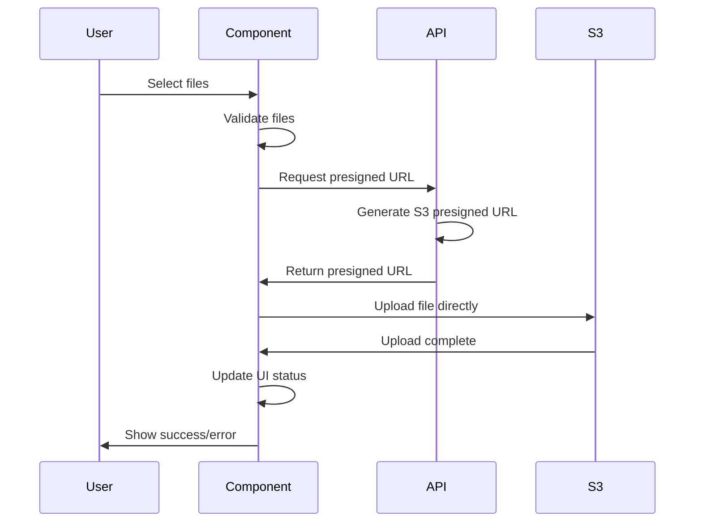

# API Documentation - BulkImageUpload Component

## 📋 Overview

This document provides comprehensive API documentation for the BulkImageUpload component, including all endpoints, request/response formats, error handling, and integration examples.

## 🔗 Base URL

```
Production: https://trafficeye.onrender.com
Development: http://localhost:3000
```

## 🔐 Authentication

All API requests require officer authentication. The component automatically includes the officer ID from the authentication context.

### Authentication Flow

1. Officer logs in through the authentication system
2. Officer ID is stored in the authentication context
3. All API requests automatically include the officer ID
4. Backend validates officer permissions

## 📡 API Endpoints

### 1. Generate Presigned URL

**Endpoint**: `POST /api/generate-presigned-url`

**Purpose**: Generate a presigned URL for direct S3 upload

**Request Body**:
```json
{
  "constable_id": "2585272"
}
```

**Request Headers**:
```http
Content-Type: application/json
```

**Response**:
```json
{
  "success": true,
  "data": {
    "uploadUrl": "https://s3.amazonaws.com/bucket/path/to/file?signature=...",
    "key": "uploads/officer_2585272/2024-12-19/image_123456.jpg",
    "expiresIn": 3600
  }
}
```

**Error Response**:
```json
{
  "success": false,
  "error": "Invalid officer ID",
  "errorCode": "INVALID_OFFICER"
}
```

**Status Codes**:
- `200`: Success
- `400`: Bad Request (invalid parameters)
- `401`: Unauthorized (invalid officer)
- `500`: Internal Server Error

### 2. Direct S3 Upload

**Endpoint**: `PUT {presignedUrl}`

**Purpose**: Upload file directly to S3 using presigned URL

**Request Headers**:
```http
Content-Type: image/jpeg
```

**Request Body**: Binary file data

**Response**: 
- `200`: Upload successful
- `403`: Presigned URL expired
- `400`: Invalid file type or size

## 🔧 Integration Examples

### TypeScript Integration

```typescript
// API Service Integration
class ApiService {
  async generatePresignedUrl(constableId: string) {
    const response = await fetch(`${this.baseUrl}/api/generate-presigned-url`, {
      method: 'POST',
      headers: {
        'Content-Type': 'application/json',
      },
      body: JSON.stringify({ constable_id: constableId }),
    });
    
    if (!response.ok) {
      throw new Error(`HTTP error! status: ${response.status}`);
    }
    
    return response.json();
  }
  
  async uploadImageToS3(imageFile: File, presignedUrl: string) {
    const response = await fetch(presignedUrl, {
      method: 'PUT',
      body: imageFile,
      headers: {
        'Content-Type': imageFile.type,
      },
    });
    
    if (!response.ok) {
      throw new Error(`S3 upload failed! status: ${response.status}`);
    }
    
    return { success: true, uploaded: true };
  }
}
```

### React Component Integration

```typescript
// Component Usage
const BulkImageUpload: React.FC = () => {
  const { currentOfficer } = useAuth();
  const [uploadedImages, setUploadedImages] = useState<UploadedImage[]>([]);
  
  const uploadImage = async (file: File) => {
    try {
      // Step 1: Get presigned URL
      const presignedResponse = await apiService.generatePresignedUrl(
        currentOfficer?.id || 'unknown'
      );
      
      if (!presignedResponse.success) {
        throw new Error('Failed to get upload URL');
      }
      
      // Step 2: Upload to S3
      await apiService.uploadImageToS3(file, presignedResponse.data.uploadUrl);
      
      // Step 3: Update UI
      setUploadedImages(prev => [...prev, {
        id: Math.random().toString(36).substr(2, 9),
        file,
        preview: URL.createObjectURL(file),
        status: 'success',
        progress: 100,
        s3Key: presignedResponse.data.key
      }]);
      
    } catch (error) {
      console.error('Upload failed:', error);
      // Handle error
    }
  };
};
```

## 📊 Data Models

### UploadedImage Interface

```typescript
interface UploadedImage {
  id: string;                    // Unique identifier
  file: File;                   // Original file object
  preview: string;              // Preview URL
  status: 'uploading' | 'success' | 'error';  // Upload status
  progress: number;             // Upload progress (0-100)
  error?: string;               // Error message if failed
  s3Key?: string;               // S3 object key
}
```

### PresignedResponse Interface

```typescript
interface PresignedResponse {
  success: boolean;
  data: {
    uploadUrl: string;    // S3 presigned URL
    key: string;         // S3 object key
    expiresIn: number;   // URL expiration time
  };
}
```

### Officer Interface

```typescript
interface Officer {
  id: string;           // Officer ID
  name: string;         // Officer name
  cadre: string;        // Officer rank/position
  psName: string;       // Police station name
}
```

## 🚨 Error Handling

### Error Types

| Error Code | Description | HTTP Status | User Action |
|------------|-------------|-------------|-------------|
| `INVALID_OFFICER` | Officer ID not found | 401 | Re-authenticate |
| `INVALID_FILE_TYPE` | Unsupported file format | 400 | Select valid image |
| `FILE_TOO_LARGE` | File exceeds size limit | 400 | Compress file |
| `UPLOAD_FAILED` | S3 upload failed | 500 | Retry upload |
| `URL_EXPIRED` | Presigned URL expired | 403 | Request new URL |
| `NETWORK_ERROR` | Network connectivity issue | - | Check connection |

### Error Response Format

```json
{
  "success": false,
  "error": "Human readable error message",
  "errorCode": "ERROR_CODE",
  "details": {
    "field": "Additional error details",
    "timestamp": "2024-12-19T10:30:00Z"
  }
}
```

### Error Handling in Component

```typescript
const handleUploadError = (error: any, imageId: string) => {
  let errorMessage = 'Upload failed';
  
  if (error.response?.status === 401) {
    errorMessage = 'Authentication required';
  } else if (error.response?.status === 400) {
    errorMessage = 'Invalid file format or size';
  } else if (error.response?.status === 403) {
    errorMessage = 'Upload URL expired';
  } else if (error.response?.status >= 500) {
    errorMessage = 'Server error, please try again';
  }
  
  setUploadedImages(prev => 
    prev.map(img => 
      img.id === imageId 
        ? { ...img, status: 'error', error: errorMessage }
        : img
    )
  );
};
```

## 🔄 Upload Flow

### Complete Upload Process



### Step-by-Step Process

1. **File Selection**
   - User selects files via drag & drop or file picker
   - Component validates file types and sizes
   - Valid files are added to upload queue

2. **Presigned URL Request**
   - Component requests presigned URL from backend
   - Backend generates S3 presigned URL with officer ID
   - URL includes expiration time and access permissions

3. **Direct S3 Upload**
   - Component uploads file directly to S3 using presigned URL
   - Progress is tracked using XMLHttpRequest events
   - Upload status is updated in real-time

4. **Status Update**
   - Component updates UI with upload status
   - Success: Green checkmark, file ready for processing
   - Error: Red alert, error message displayed

## 🛡️ Security Considerations

### Presigned URL Security

- URLs expire after 1 hour
- URLs are tied to specific officer ID
- URLs have limited permissions (PUT only)
- URLs are generated server-side with proper validation

### File Validation

- File type validation (images only)
- File size limits (10MB per file)
- Maximum file count (20 files per session)
- Officer authentication required

### Data Privacy

- Files are uploaded directly to S3
- No intermediate server storage
- Officer ID is included in S3 key for tracking
- Files are processed asynchronously

## 📈 Performance Optimization

### Upload Optimization

- Direct S3 uploads (no server bottleneck)
- Parallel uploads for multiple files
- Progress tracking without polling
- Efficient memory management

### Network Optimization

- Presigned URLs reduce server load
- Binary uploads (no base64 encoding)
- Compression for large files
- Retry mechanism for failed uploads

## 🧪 Testing

### API Testing

```typescript
// Unit test example
describe('API Service', () => {
  test('generates presigned URL correctly', async () => {
    const mockResponse = {
      success: true,
      data: {
        uploadUrl: 'https://s3.amazonaws.com/...',
        key: 'uploads/officer_123/image.jpg',
        expiresIn: 3600
      }
    };
    
    jest.spyOn(global, 'fetch').mockResolvedValue({
      ok: true,
      json: () => Promise.resolve(mockResponse)
    } as Response);
    
    const result = await apiService.generatePresignedUrl('123');
    expect(result).toEqual(mockResponse);
  });
});
```

### Integration Testing

```typescript
// Integration test example
describe('BulkImageUpload Integration', () => {
  test('uploads file successfully', async () => {
    const file = new File(['test'], 'test.jpg', { type: 'image/jpeg' });
    const component = render(<BulkImageUpload />);
    
    // Simulate file selection
    fireEvent.change(component.getByTestId('file-input'), {
      target: { files: [file] }
    });
    
    // Wait for upload to complete
    await waitFor(() => {
      expect(component.getByText('Uploaded')).toBeInTheDocument();
    });
  });
});
```

## 🔧 Configuration

### Environment Variables

```env
# Backend API URL
VITE_BACKEND_API_URL=https://trafficeye.onrender.com

# AWS S3 Configuration (Backend)
AWS_ACCESS_KEY_ID=your_access_key
AWS_SECRET_ACCESS_KEY=your_secret_key
AWS_S3_BUCKET=your_bucket_name
AWS_REGION=us-east-1
```

### Component Configuration

```typescript
// Configurable constants
const MAX_IMAGES = 20;
const MAX_FILE_SIZE = 10 * 1024 * 1024; // 10MB
const ACCEPTED_TYPES = ['image/jpeg', 'image/jpg', 'image/png', 'image/webp'];
const UPLOAD_TIMEOUT = 30000; // 30 seconds
```

## 📚 SDK Examples

### JavaScript/TypeScript

```typescript
// Basic usage
import { BulkImageUpload } from './components/BulkImageUpload';

function App() {
  return (
    <div>
      <BulkImageUpload />
    </div>
  );
}
```

### React Integration

```typescript
// With custom props
<BulkImageUpload
  maxFiles={20}
  maxFileSize={10 * 1024 * 1024}
  acceptedTypes={['image/jpeg', 'image/png']}
  onUploadComplete={(images) => console.log('Uploaded:', images)}
  onUploadError={(error) => console.error('Error:', error)}
/>
```

## 🚀 Deployment

### Production Deployment

1. **Build the application**
   ```bash
   npm run build
   ```

2. **Configure environment variables**
   ```env
   VITE_BACKEND_API_URL=https://your-production-api.com
   ```

3. **Deploy to hosting platform**
   - Vercel, Netlify, AWS S3, etc.

### Backend Configuration

1. **Configure AWS S3**
   - Create S3 bucket
   - Set up CORS policy
   - Configure IAM permissions

2. **Deploy backend API**
   - Ensure presigned URL endpoint is working
   - Configure officer authentication
   - Set up monitoring and logging

## 📞 Support

### Getting Help

1. **Check the documentation** above
2. **Review error messages** in the browser console
3. **Test API endpoints** using tools like Postman
4. **Contact the development team** for technical support

### Common Issues

1. **Upload fails immediately**
   - Check network connection
   - Verify backend API is running
   - Check officer authentication

2. **Files not uploading**
   - Verify file format is supported
   - Check file size limits
   - Ensure presigned URL is valid

3. **Progress not updating**
   - Check browser compatibility
   - Verify XMLHttpRequest support
   - Check for JavaScript errors

---

*Last updated: December 2024*
*Version: 1.0.0*
