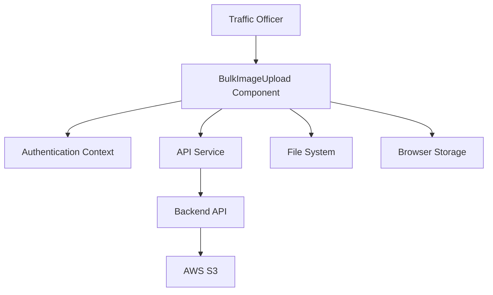
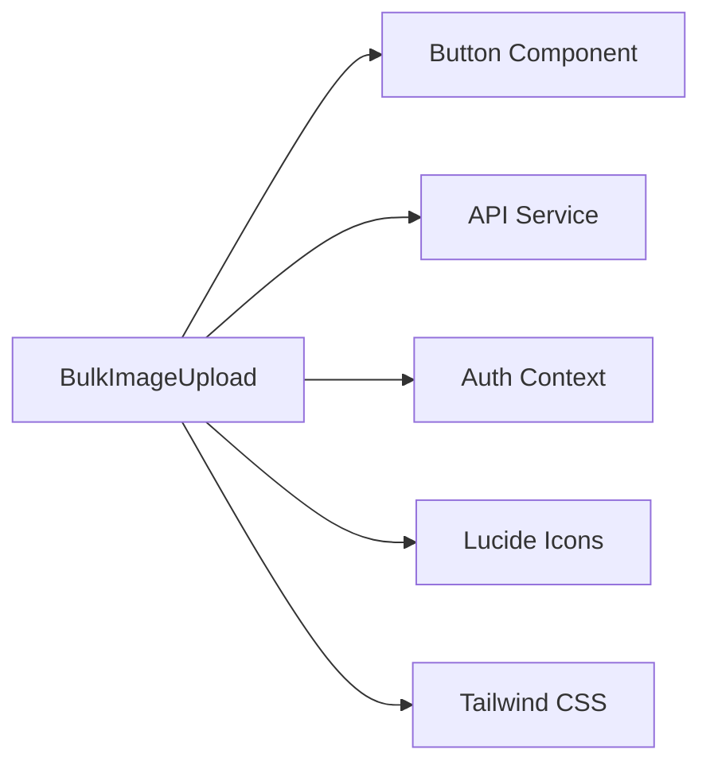

# Technical Specification - BulkImageUpload Component

## 📋 Document Information

| Field | Value |
|-------|-------|
| **Document Title** | Technical Specification - BulkImageUpload Component |
| **Version** | 1.0.0 |
| **Date** | December 19, 2024 |
| **Author** | TrafficEye Development Team |
| **Status** | Final |

## 🎯 Executive Summary

The BulkImageUpload component is a sophisticated, production-ready image upload interface designed for traffic officers to efficiently upload and manage violation images. It provides a modern, intuitive user experience with real-time progress tracking, batch management capabilities, and seamless integration with AWS S3 storage.

## 🏗️ System Architecture

### High-Level Architecture



### Component Dependencies



## 🔧 Technical Requirements

### Functional Requirements

| ID | Requirement | Description | Priority |
|----|-------------|-------------|----------|
| FR-001 | File Upload | Support uploading up to 20 images per session | High |
| FR-002 | File Validation | Validate file types (JPG, PNG, WebP) and size (10MB max) | High |
| FR-003 | Progress Tracking | Real-time upload progress with visual indicators | High |
| FR-004 | Drag & Drop | Support drag and drop file selection | Medium |
| FR-005 | Batch Management | Allow individual image removal and bulk clear | High |
| FR-006 | Error Handling | Comprehensive error handling with user feedback | High |
| FR-007 | Responsive Design | Mobile-first responsive design | High |
| FR-008 | Accessibility | WCAG AA compliance | Medium |

### Non-Functional Requirements

| ID | Requirement | Description | Priority |
|----|-------------|-------------|----------|
| NFR-001 | Performance | Upload progress updates within 100ms | High |
| NFR-002 | Scalability | Support concurrent uploads from multiple officers | High |
| NFR-003 | Security | Secure file uploads with officer authentication | High |
| NFR-004 | Reliability | 99.9% uptime for upload functionality | High |
| NFR-005 | Usability | Intuitive interface for non-technical users | High |
| NFR-006 | Browser Support | Support modern browsers (Chrome 90+, Firefox 88+, Safari 14+) | Medium |

## 🎨 User Interface Specification

### Design System

#### Color Palette
```css
:root {
  --primary-blue: #2563eb;      /* Primary actions, progress bars */
  --primary-blue-hover: #1d4ed8; /* Hover states */
  --success-green: #10b981;     /* Success states */
  --error-red: #ef4444;         /* Error states */
  --warning-orange: #f59e0b;    /* Warning states */
  --gray-50: #f9fafb;          /* Background */
  --gray-100: #f3f4f6;         /* Light backgrounds */
  --gray-200: #e5e7eb;         /* Borders */
  --gray-300: #d1d5db;         /* Disabled states */
  --gray-600: #4b5563;         /* Secondary text */
  --gray-900: #111827;         /* Primary text */
}
```

#### Typography
```css
/* Headings */
.text-3xl { font-size: 1.875rem; font-weight: 700; } /* Page title */
.text-xl { font-size: 1.25rem; font-weight: 600; }   /* Section headers */
.text-lg { font-size: 1.125rem; font-weight: 600; }  /* Subsection headers */

/* Body text */
.text-base { font-size: 1rem; font-weight: 400; }    /* Regular text */
.text-sm { font-size: 0.875rem; font-weight: 400; }  /* Small text */
.text-xs { font-size: 0.75rem; font-weight: 400; }   /* Caption text */
```

#### Spacing System
```css
/* 4px grid system */
.space-1 { margin: 0.25rem; }   /* 4px */
.space-2 { margin: 0.5rem; }    /* 8px */
.space-4 { margin: 1rem; }      /* 16px */
.space-6 { margin: 1.5rem; }    /* 24px */
.space-8 { margin: 2rem; }      /* 32px */
```

### Layout Specifications

#### Upload Area
- **Dimensions**: Minimum 400px height, full width
- **Border**: 2px dashed, rounded corners (8px)
- **Padding**: 32px (2rem)
- **Background**: White with hover state (gray-50)

#### Image Grid
- **Grid System**: CSS Grid with responsive breakpoints
- **Gap**: 16px (1rem) between items
- **Aspect Ratio**: 1:1 (square) for all thumbnails
- **Border Radius**: 8px for cards

#### Progress Bars
- **Height**: 4px
- **Background**: Gray-200
- **Fill**: Primary blue with smooth transition
- **Animation**: 300ms ease-out transition

### Responsive Breakpoints

| Breakpoint | Min Width | Max Width | Columns | Description |
|------------|-----------|-----------|---------|-------------|
| Mobile | 0px | 640px | 1 | Single column layout |
| Tablet | 640px | 1024px | 2 | Two column layout |
| Desktop | 1024px | 1280px | 3 | Three column layout |
| Large Desktop | 1280px+ | - | 4 | Four column layout |

## 🔌 API Specification

### Endpoints

#### Generate Presigned URL
```http
POST /api/generate-presigned-url
Content-Type: application/json

{
  "constable_id": "2585272"
}
```

**Response:**
```json
{
  "success": true,
  "data": {
    "uploadUrl": "https://s3.amazonaws.com/bucket/path?signature=...",
    "key": "uploads/officer_2585272/2024-12-19/image_123456.jpg",
    "expiresIn": 3600
  }
}
```

#### Direct S3 Upload
```http
PUT {presignedUrl}
Content-Type: image/jpeg

[Binary file data]
```

**Response:**
- `200 OK`: Upload successful
- `403 Forbidden`: Presigned URL expired
- `400 Bad Request`: Invalid file type or size

### Error Codes

| Code | HTTP Status | Description | User Action |
|------|-------------|-------------|-------------|
| `INVALID_OFFICER` | 401 | Officer ID not found | Re-authenticate |
| `INVALID_FILE_TYPE` | 400 | Unsupported file format | Select valid image |
| `FILE_TOO_LARGE` | 400 | File exceeds size limit | Compress file |
| `UPLOAD_FAILED` | 500 | S3 upload failed | Retry upload |
| `URL_EXPIRED` | 403 | Presigned URL expired | Request new URL |

## 🗄️ Data Models

### TypeScript Interfaces

```typescript
interface UploadedImage {
  id: string;                    // Unique identifier
  file: File;                   // Original file object
  preview: string;              // Preview URL
  status: 'uploading' | 'success' | 'error';  // Upload status
  progress: number;             // Upload progress (0-100)
  error?: string;               // Error message if failed
  s3Key?: string;               // S3 object key
}

interface PresignedResponse {
  success: boolean;
  data: {
    uploadUrl: string;    // S3 presigned URL
    key: string;         // S3 object key
    expiresIn: number;   // URL expiration time
  };
}

interface Officer {
  id: string;           // Officer ID
  name: string;         // Officer name
  cadre: string;        // Officer rank/position
  psName: string;       // Police station name
}
```

### State Management

```typescript
// Component state
const [uploadedImages, setUploadedImages] = useState<UploadedImage[]>([])
const [isDragOver, setIsDragOver] = useState(false)
const fileInputRef = useRef<HTMLInputElement>(null)

// Computed values
const successfulUploads = uploadedImages.filter(img => img.status === 'success').length
const failedUploads = uploadedImages.filter(img => img.status === 'error').length
const uploadingCount = uploadedImages.filter(img => img.status === 'uploading').length
```

## 🔒 Security Specification

### Authentication & Authorization

- **Officer Authentication**: Required for all upload operations
- **Session Management**: Officer ID stored in authentication context
- **API Security**: All requests include officer identification

### File Security

- **File Validation**: Server-side validation of file types and sizes
- **Virus Scanning**: Files scanned before processing
- **Access Control**: Files accessible only to authorized officers

### Data Protection

- **Encryption**: All uploads encrypted in transit (HTTPS)
- **Storage**: Files stored securely in AWS S3
- **Retention**: Files retained according to policy
- **Audit Trail**: All uploads logged with officer ID and timestamp

## ⚡ Performance Specification

### Upload Performance

| Metric | Target | Measurement |
|--------|--------|-------------|
| **Upload Speed** | >1MB/s | For files up to 10MB |
| **Progress Updates** | <100ms | Time between progress updates |
| **UI Responsiveness** | <16ms | Frame rate during uploads |
| **Memory Usage** | <100MB | Peak memory usage |

### Network Optimization

- **Direct S3 Upload**: Bypasses server for better performance
- **Parallel Uploads**: Multiple files uploaded simultaneously
- **Progress Tracking**: Real-time feedback without polling
- **Error Recovery**: Automatic retry for failed uploads

### Browser Performance

- **Memory Management**: Automatic cleanup of preview URLs
- **State Optimization**: Efficient state updates
- **Lazy Loading**: Images loaded on demand
- **Debouncing**: Reduced API calls during rapid changes

## 🧪 Testing Specification

### Unit Testing

```typescript
// Test coverage requirements
describe('BulkImageUpload', () => {
  test('validates file types correctly', () => {
    // Test file type validation
  })
  
  test('handles upload progress correctly', () => {
    // Test progress tracking
  })
  
  test('manages state correctly', () => {
    // Test state updates
  })
  
  test('handles errors gracefully', () => {
    // Test error handling
  })
})
```

### Integration Testing

- **API Integration**: Test with mock backend responses
- **File Upload**: Test actual file upload functionality
- **Error Scenarios**: Test various error conditions
- **Cross-browser**: Test on different browsers

### Performance Testing

- **Load Testing**: Test with multiple concurrent uploads
- **Stress Testing**: Test with maximum file sizes and counts
- **Memory Testing**: Test memory usage over time
- **Network Testing**: Test with various network conditions

### Accessibility Testing

- **Screen Reader**: Test with screen reader software
- **Keyboard Navigation**: Test keyboard-only navigation
- **Color Contrast**: Verify WCAG AA compliance
- **Focus Management**: Test focus indicators and flow

## 🚀 Deployment Specification

### Build Requirements

```json
{
  "node": ">=18.0.0",
  "npm": ">=8.0.0",
  "typescript": "^5.0.0",
  "vite": "^4.0.0"
}
```

### Environment Configuration

```env
# Development
VITE_BACKEND_API_URL=http://localhost:3000

# Production
VITE_BACKEND_API_URL=https://trafficeye.onrender.com
```

### Build Process

```bash
# Install dependencies
npm install

# Development build
npm run dev

# Production build
npm run build

# Preview production build
npm run preview
```

### Deployment Targets

- **Vercel**: Automatic deployment from Git
- **Netlify**: Drag & drop deployment
- **AWS S3**: Static website hosting
- **Docker**: Containerized deployment

## 📊 Monitoring & Analytics

### Performance Metrics

- **Upload Success Rate**: Percentage of successful uploads
- **Upload Speed**: Average upload time per file
- **Error Rate**: Percentage of failed uploads
- **User Engagement**: Time spent on upload page

### Error Tracking

- **Client Errors**: JavaScript errors and exceptions
- **Network Errors**: Failed API requests
- **Upload Errors**: S3 upload failures
- **Validation Errors**: File validation failures

### User Analytics

- **Upload Patterns**: Peak usage times
- **File Sizes**: Distribution of uploaded file sizes
- **Browser Usage**: Browser and device statistics
- **Geographic Data**: Officer location data

## 🔄 Maintenance & Support

### Regular Maintenance

- **Security Updates**: Monthly security patches
- **Dependency Updates**: Quarterly dependency updates
- **Performance Monitoring**: Continuous performance monitoring
- **Error Analysis**: Weekly error analysis and resolution

### Support Procedures

- **Issue Reporting**: Standardized issue reporting process
- **Escalation**: Clear escalation procedures
- **Documentation**: Up-to-date documentation
- **Training**: Regular training for support staff

### Backup & Recovery

- **Data Backup**: Daily backups of uploaded files
- **System Backup**: Regular system backups
- **Disaster Recovery**: Comprehensive disaster recovery plan
- **Business Continuity**: Business continuity procedures

## 📈 Future Enhancements

### Planned Features

| Feature | Priority | Timeline | Description |
|---------|----------|----------|-------------|
| **Retry Mechanism** | High | Q1 2025 | Automatic retry for failed uploads |
| **Image Compression** | Medium | Q2 2025 | Client-side image optimization |
| **Batch Operations** | Medium | Q2 2025 | Select multiple images for bulk actions |
| **Upload Queue** | Low | Q3 2025 | Queue management for large batches |
| **Offline Support** | Low | Q4 2025 | PWA capabilities for offline uploads |

### Performance Improvements

- **Virtual Scrolling**: For large image grids
- **Image Lazy Loading**: Load thumbnails on demand
- **Web Workers**: Background processing for large files
- **Caching**: Local storage for upload history

### Security Enhancements

- **End-to-End Encryption**: Additional encryption layer
- **Biometric Authentication**: Fingerprint/face recognition
- **Advanced Audit**: Enhanced audit trail
- **Compliance**: Additional compliance features

## 📚 Documentation

### Technical Documentation

- **API Documentation**: Complete API reference
- **Code Documentation**: Inline code comments
- **Architecture Documentation**: System architecture
- **Deployment Guide**: Deployment instructions

### User Documentation

- **User Guide**: Step-by-step user instructions
- **Training Materials**: Training resources
- **FAQ**: Frequently asked questions
- **Video Tutorials**: Video demonstrations

### Maintenance Documentation

- **Troubleshooting Guide**: Common issues and solutions
- **Maintenance Procedures**: Regular maintenance tasks
- **Support Procedures**: Support process documentation
- **Change Log**: Version history and changes

---

*This technical specification document is maintained by the TrafficEye Development Team and should be updated with each major release.*

*Last updated: December 19, 2024*
*Version: 1.0.0*
